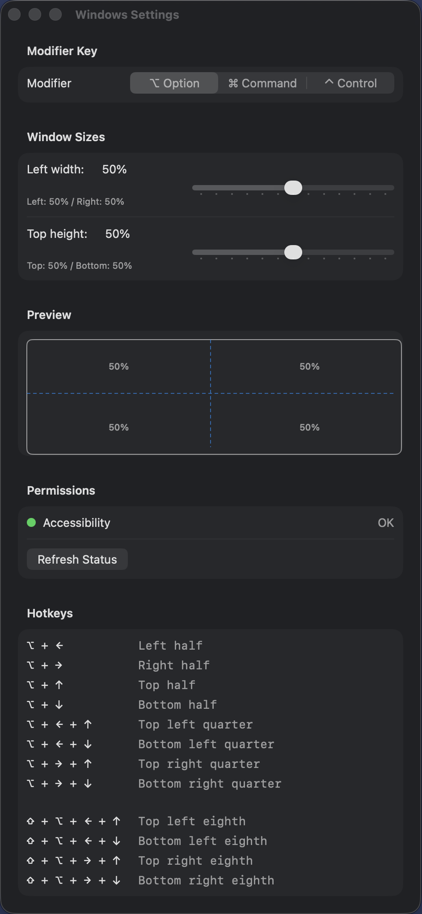
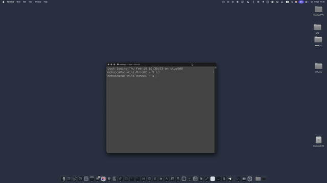

# Windows

A lightweight window manager for macOS. Not a tiling manager — it lets you snap any window to a precise position on screen using keyboard shortcuts, without forcing a tiling layout on all your windows.





## Features

- Snap windows to halves, quarters, and eighths of the screen
- Center any window at 60% of the screen with a single shortcut
- Configurable split ratios (left/right width, top/bottom height)
- Works on any screen, including multi-monitor setups
- Menu bar app — lives quietly in the background
- Launch at Login option in Settings

## Shortcuts

Hold your chosen modifier key (Option, Command, or Control), then press arrow keys:

| Shortcut | Action |
|---|---|
| Mod + C | Center (60% of screen) |
| Mod + ← | Left half |
| Mod + → | Right half |
| Mod + ↑ | Top half |
| Mod + ↓ | Bottom half |
| Mod + ← + ↑ | Top left quarter |
| Mod + ← + ↓ | Bottom left quarter |
| Mod + → + ↑ | Top right quarter |
| Mod + → + ↓ | Bottom right quarter |
| ⇧ + Mod + ← + ↑ | Top left eighth |
| ⇧ + Mod + ← + ↓ | Bottom left eighth |
| ⇧ + Mod + → + ↑ | Top right eighth |
| ⇧ + Mod + → + ↓ | Bottom right eighth |

## Installation

Since the app is not notarized, macOS will block it on first launch. To open it:

1. Mount the DMG and drag **windows.app** to Applications
2. Try to open it — macOS will show *"can't be opened because it is from an unidentified developer"*
3. Go to **System Settings → Privacy & Security**
4. Scroll down and click **"Open Anyway"**
5. Click **Open** in the confirmation dialog

Alternatively, you can run this command in Terminal after copying the app to Applications:
```bash
xattr -cr /Applications/windows.app
```

## Requirements

- macOS 13+
- Accessibility permission
